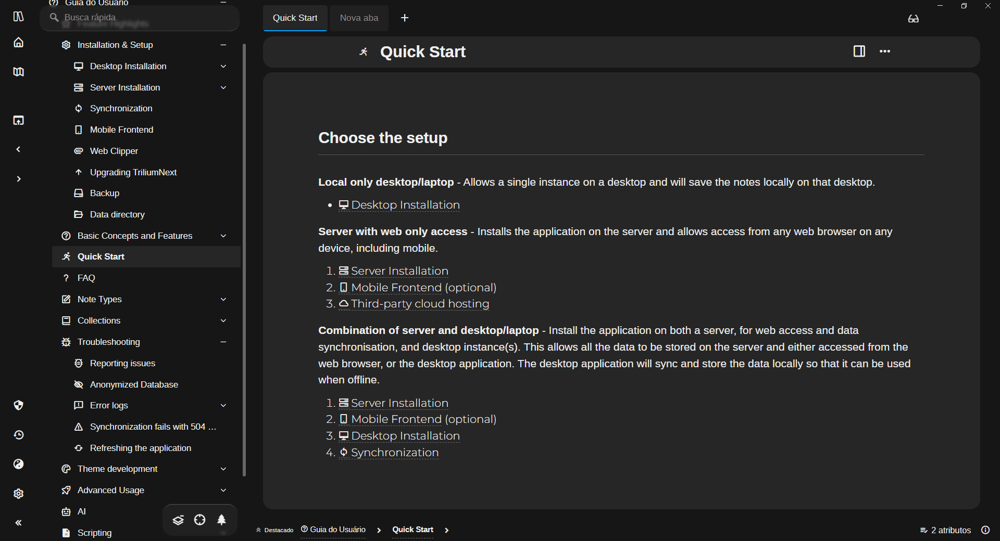

[Original Theme Repository](https://github.com/JadeVane/Allure)
> Tested on: [TriliumNext 0.102.1](https://github.com/TriliumNext/Trilium/releases/tag/v0.102.1) with new layout, but not completed :)  
> I suspect that can be different for others devices and resolutions, try it and tell me how it goes.

## Preview

- Glass effects
- Alot of Rounded corners
- An attempt to create an intuitive interface
- Credits also to: [Font Awesome](https://fontawesome.com/)

# Installation

## 1. Recommended 👍
1. Download `Allure-Refresh.zip` in the [release page](https://github.com/danielsdot/Allure-Refresh/releases), then go back to Trilium and right-click on any note and select "Import to note"
2. Select the file you just downloaded and **uncheck Safe Import**, then click "Import"
> How to upgrade?
> Delete the theme file and re-import the latest version.
## 2. Manual 🧱
1. Create a new note in trilium (of type **CSS**) named `Allure-Refresh` *(the name of note depends on which theme you want to apply)*
1. Pick the theme: [Allure-Refresh.css](./Allure-Refresh.css), copy the content of it and paste it into the new note created above:
    <!-- - [Allure-Refresh.css](https://github.com/JadeVane/Allure/releases/latest/download/Allure-Night.css) -->
1. Add `#appTheme=[theme_name]` attribute to the note
1. Download all the fonts in [fonts](./fonts/), then right-click on the note and select `Import to note` to import all fonts
1. Add attribute `#customResourceProvider="font-name.suffix"` to each fonts
> How to upgrade?
> Copy the latest CSS file content and replace Allure-icon.woff2 in it. If other fonts are updated, other font files also need to be replaced.
## 3. How to **enable the theme** ✅
1. Go to Menu > Options > Appereance, and select `Allure-Refresh` as your new theme
1. Press `F5` or `Ctrl` + `R` to reload the page, or reopen the app.
